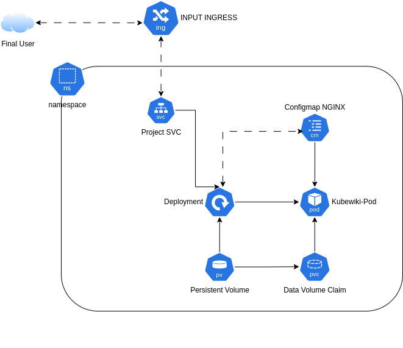

  
# Projeto Kubewiki

Este projeto implementa a aplicação DokuWiki no Kubernetes, utilizando Nginx como servidor web. A configuração é feita para garantir que a aplicação seja acessível externamente e que os recursos sejam alocados e ajustados conforme necessário.

## Objetivo
O objetivo deste projeto está centrado nas peças criadas dentro de um cluster Kubernetes utilizando práticas que são comumente utilizadas em ambientes de trabalho no mundo real. O Dockerfile criado é apenas para que seja possível utilizarmos uma imagem desenvolvida "dentro de casa".

## Componentes

O projeto consiste nos seguintes componentes principais:

- **Nginx Pod**: Roda a aplicação Nginx que serve a DokuWiki.
- **ConfigMap**: Armazena a configuração do Nginx.
- **Persistent Volume (PV)** e **Persistent Volume Claim (PVC)**: Armazenam os dados da DokuWiki.
- **Service**: Permite o acesso à aplicação dentro do cluster.
- **Ingress**: Permite o acesso externo à aplicação.
- **Vertical Pod Autoscaler (VPA)**: Ajusta automaticamente os recursos alocados para a aplicação.

## Pré-requisitos

- Kubernetes cluster
- kubectl configurado para se comunicar com o seu cluster
- Para o VPA, ter o Vertical Pod AutoScaler configurado no cluster

## Instalação
O processo de instalação é simples, bastando fazer o clone do repositório, entrar no diretório clonado e executar o comando <code>./setup.sh --install</code> para que os componentes sejam instalados na ordem correta; Depois será perguntado se deseja instalar os componentes extras, como o VPA e o Ingress.

Se desejar remover o projeto, basta rodar o mesmo script com a opção ```uninstall``` como <code>./setup.sh --uninstall</code>

## Visão do Projeto


### Melhorias futuras
- Adicionar ___sidecar___ do Metrics-Server para coletar estatísticas de uso e outras informações do projeto
- ~~**Configurar as Probes para monitoramento do Pod**~~
---
  
# Kubewiki Project

This project implements the DokuWiki application on Kubernetes, using Nginx as the web server. The setup is designed to ensure that the application is accessible externally and that resources are allocated and adjusted as needed.

## Goal
The project goal was focused on creation of kubernetes objects using commonly practices from real world environments. The Dockerfile created is just to have a self-created application image.

## Components

The project consists of the following main components:

- **Nginx Pod**: Runs the Nginx application that serves DokuWiki.
- **ConfigMap**: Stores the Nginx configuration.
- **Persistent Volume (PV)** and **Persistent Volume Claim (PVC)**: Store the DokuWiki data.
- **Service**: Allows access to the application within the cluster.
- **Ingress**: Enables external access to the application.
- **Vertical Pod Autoscaler (VPA)**: Automatically adjusts the resources allocated to the application.

## Prerequisites

- Kubernetes cluster
- kubectl configured to communicate with your cluster
- To use VPA, need to have configured Vertical Pod Autoscaler in your cluster

## Installation Guide

The installation process is too simple, just needing to clone this repository, access the directory downloaded and run <code>./setup.sh --install</code> and all objects will be created following the right creation order; After that, just need to answer future questions to choice if you wanna install VPA and/or Ingress extra components.

If you wanna remove components, just run <code>./setup.sh --uninstall</code> and all previously created objects will be deleted.

## Project Overview


### Future updates
- Add Metrics-Server ___sidecar___ to collect stats and other project information
- ~~**Configure Deployment Probes**~~
